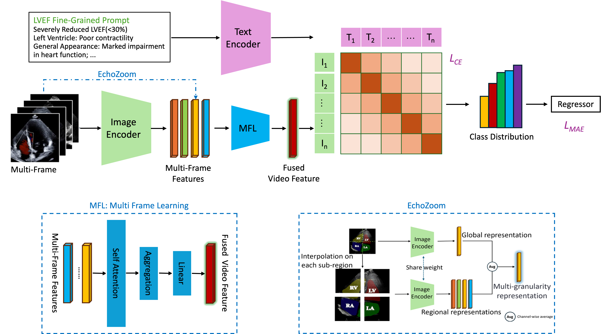

# CardiacCLIP

This repository contains PyTorch implementation of ["CardiacCLIP: Video-based CLIP Adaptation for LVEF Prediction in a Few-shot Manner" (MICCAI 2025)](https://arxiv.org/abs/2509.17065).

Created by [Du Yao](https://scholar.google.com.hk/citations?user=8krbrWsAAAAJ&hl=zh-CN), [Guo Jiarong](https://scholar.google.com.hk/citations?hl=zh-CN&user=IT5sfsYAAAAJ&inst=1381320739207392350), [Li Xiaomeng](https://xmengli.github.io/)\*


## Overview of CardiacCLIP

CardiacCLIP is a novel adaptation of CLIP models for few-shot echocardiogram video analysis, capturing crucial temporal dynamics and localized cardiac structures essential for accurate diagnosis.




### 🔑 Key Idea

- **Multi-Frame Learning (MFL)**  
  An attention-based aggregation mechanism that **prioritizes diagnostically relevant frames** instead of simple averaging.  

- **EchoZoom**  
  A multi-scale input representation strategy that **enhances modeling of fine-grained cardiac structures**.  


## Training & Evaluation


1. Change the dataset path in `/echoclip/runner/data.py` (around line 330).

2. Run the training script:

```bash
sh scripts/run.sh
```

Results and logs will be saved in the results/ and wandb/ folders.


## Citation

If you find this repository useful, please cite our work:

```
@article{du2025cardiacclip,
  title   = {CardiacCLIP: Video-based CLIP Adaptation for LVEF Prediction in a Few-shot Manner},
  author  = {Du, Yao and Guo, Jiarong and Li, Xiaomeng},
  journal = {arXiv preprint arXiv:2509.17065},
  year    = {2025},
  eprint  = {2509.17065},
  archivePrefix = {arXiv},
  primaryClass = {cs.CV}
}
```
